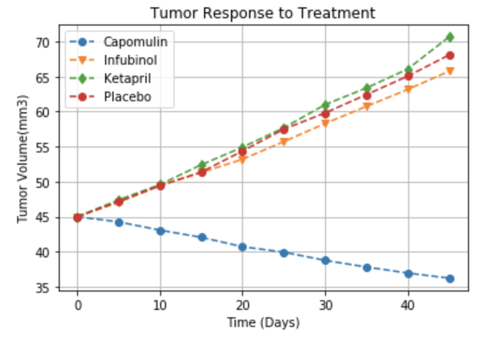
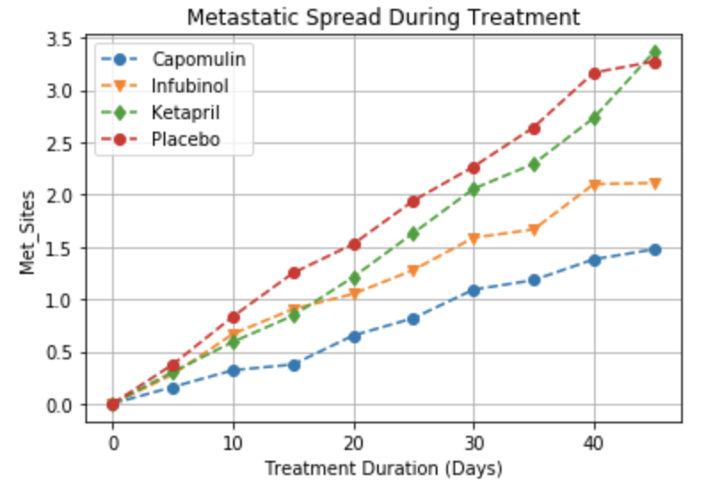
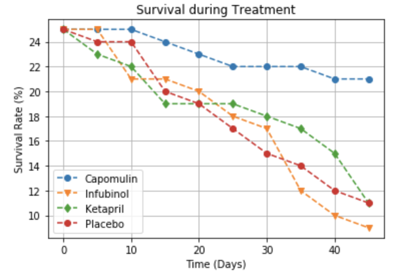
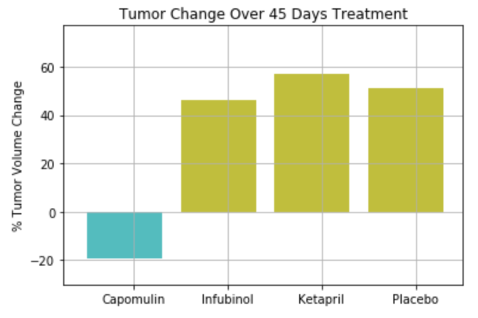

# Pymaceuticals

## Overview:

The tumor response to several cancer treatments were compared for 250 mice over the course of 45 days. Changes in tumor volume, number of metastatic sites and survival rates were calculated and analyzed. The results were visualized using Matplotlib.

## Datasets:

Two datasets were used in this analysis. The first called “mouse_drug_data.csv" contains the mouse ID and the treatment that was used. The second dataset called "clinicaltrial_data.csv" contains the mouse ID, and the tumor volume and metastatic sites at specific time points. 

## Workflow:

From the two datasets, DataFrames were created and merged on the mouse ID. First, the tumor response to treatment was determined by calculating the average tumor volume for each drug at each time point. This shows how the tumor volume changes over time for each treatment. Also, the standard error of tumor volumes was calculated for each treatment at every timepoint and a pivot table was created to re-format the DataFrame. The results were graphed in a scatter plot using Matplotlib. 

Second, the spread of the cancer as a response to each treatment was calculated for each treatment at every timepoint. This was determined by calculating the average number of metastatic sites. The standard error of average metastatic sites was calculated for each treatment at every timepoint and the results were graphed in a scatter plot using Matplotlib.

Third, the survival rate as a response to each treatment was calculated for each treatment at every timepoint. This was achieved by counting the distinct mouse ID values for each treatment at every time point. The results were graphed in a scatter plot using Matplotlib.

Finally, the percentage of tumor volume change for each drug was determined by calculating the difference between the tumor volume during the first and last time points. The results were visualized in a bar graph using Matplotlib. 

## Observations:
### Three observable trends found during this analysis are the following:
- Over time, Capomulin is the only drug that reduces the tumor volume. For the other drugs, the tumor volume increases, meaning they are not effective. On the other hand, Capomulin shows an efficient result by decreasing tumor size. 
    
- When using Ketapril, the tumor volume increased even more than when using placebo. This means that Ketapril has an opposite effect to the desired decrease in tumor. 
    
- Capomulin has the best survival rate compared to the other three drugs. This means it produces the best desired effect on tumor treatment.

